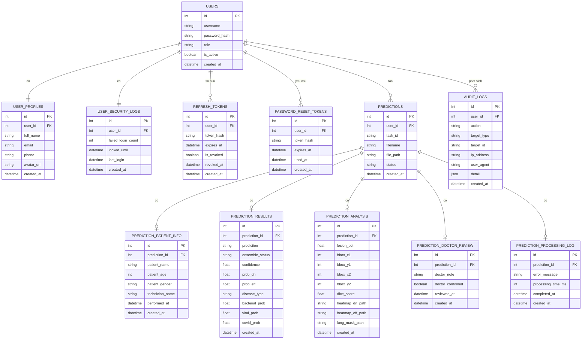
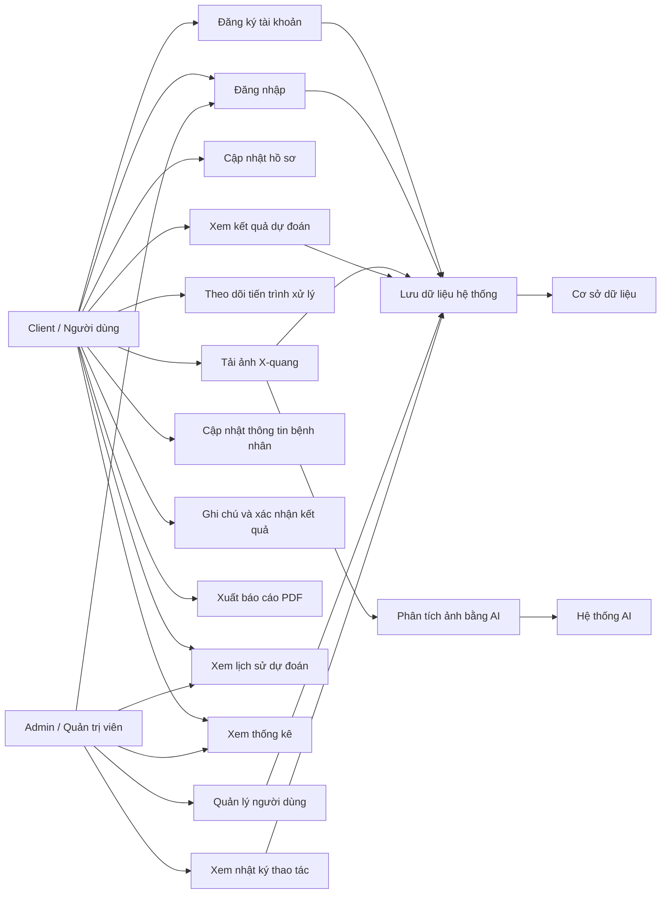

**HỆ THỐNG PHÁT HIỆN VIÊM PHỔI QUA ẢNH X-QUANG**

Một hệ thống web cần tin học hóa quy trình hỗ trợ phát hiện viêm phổi từ ảnh X-quang ngực. Người dùng của hệ thống có thể đăng ký tài khoản, đăng nhập, cập nhật thông tin cá nhân, tải ảnh X-quang lên hệ thống và nhận kết quả phân tích từ mô hình trí tuệ nhân tạo.

Khi người dùng tải ảnh X-quang lên, hệ thống sẽ lưu ảnh, tạo một mã tác vụ xử lý và đưa ảnh vào quy trình dự đoán. Mô hình AI sẽ phân loại ảnh là bình thường hoặc có dấu hiệu viêm phổi. Nếu ảnh có dấu hiệu viêm phổi, hệ thống có thể phân tích thêm loại bệnh như viêm phổi do vi khuẩn, virus hoặc COVID. Ngoài ra, hệ thống còn tạo ảnh Grad-CAM/heatmap để hỗ trợ người dùng quan sát vùng ảnh có ảnh hưởng đến kết quả dự đoán.

Trong quá trình xử lý, hệ thống cập nhật trạng thái theo thời gian thực để người dùng biết ảnh đang chờ xử lý, đang phân tích, đã hoàn tất hoặc bị lỗi. Sau khi có kết quả, người dùng có thể xem lại lịch sử dự đoán, cập nhật thông tin bệnh nhân, ghi chú của bác sĩ, xác nhận kết quả và xuất báo cáo PDF.

Quản trị viên có quyền quản lý người dùng, khóa/mở khóa tài khoản, xem thống kê tổng quan, xem lịch sử dự đoán toàn hệ thống và theo dõi nhật ký thao tác. Hệ thống cần lưu lại thông tin đăng nhập, hồ sơ người dùng, token làm mới phiên đăng nhập, token đặt lại mật khẩu, kết quả dự đoán, thông tin bệnh nhân, kết quả phân tích ảnh, ghi chú bác sĩ, nhật ký xử lý và nhật ký kiểm toán.

**Câu hỏi:**

1. Hãy xác định các loại thực thể cùng thuộc tính tương ứng, gạch chân dưới khóa chính.

2. Xác định mối kết hợp giữa các loại thực thể và cặp bản số tương ứng. Vẽ mô hình ERD của mô tả trên.

3. Xác định actor và các Use Case chính của hệ thống.

**Giải**

**--UML:**

+ DB cần tạo bao nhiêu Table? **12 table chính**

Các table gồm:

1. USERS
2. USER_PROFILES
3. USER_SECURITY_LOGS
4. REFRESH_TOKENS
5. PASSWORD_RESET_TOKENS
6. PREDICTIONS
7. PREDICTION_PATIENT_INFO
8. PREDICTION_RESULTS
9. PREDICTION_ANALYSIS
10. PREDICTION_DOCTOR_REVIEW
11. PREDICTION_PROCESSING_LOG
12. AUDIT_LOGS

+ Có bao nhiêu xử lý cần thiết kế và coding?

Cần có các nhóm xử lý chính liên quan đến 12 table trên, bao gồm:

1. Quản lý tài khoản người dùng.
2. Đăng ký, đăng nhập, đăng xuất.
3. Làm mới token đăng nhập.
4. Quên mật khẩu và đặt lại mật khẩu.
5. Cập nhật hồ sơ cá nhân.
6. Upload ảnh X-quang.
7. Chạy dự đoán viêm phổi bằng mô hình AI.
8. Cập nhật trạng thái xử lý theo thời gian thực.
9. Lưu kết quả dự đoán.
10. Lưu thông tin bệnh nhân.
11. Lưu kết quả phân tích ảnh/heatmap.
12. Ghi chú và xác nhận kết quả bởi bác sĩ.
13. Xem lịch sử dự đoán.
14. Xuất báo cáo PDF.
15. Thống kê kết quả dự đoán.
16. Quản trị người dùng.
17. Ghi nhận và xem nhật ký thao tác.

**--Xác định các loại thực thể**

**1. Loại thực thể cơ bản**

**USERS**(<u>id</u>, username, password_hash, role, is_active, created_at)

Ý nghĩa: Lưu thông tin xác thực cơ bản của tài khoản trong hệ thống.

**USER_PROFILES**(<u>id</u>, user_id, full_name, email, phone, avatar_url, created_at)

Ý nghĩa: Lưu thông tin cá nhân của người dùng.

**USER_SECURITY_LOGS**(<u>id</u>, user_id, failed_login_count, locked_until, last_login, created_at)

Ý nghĩa: Lưu thông tin bảo mật liên quan đến đăng nhập của người dùng.

**REFRESH_TOKENS**(<u>id</u>, user_id, token_hash, expires_at, is_revoked, revoked_at, created_at)

Ý nghĩa: Lưu token dùng để làm mới phiên đăng nhập.

**PASSWORD_RESET_TOKENS**(<u>id</u>, user_id, token_hash, expires_at, used_at, created_at)

Ý nghĩa: Lưu token đặt lại mật khẩu.

**2. Loại thực thể đối tượng ngoài**

**NGUOIDUNG / USER**

Trong hệ thống thực tế, người dùng có thể là:

+ Bác sĩ.
+ Kỹ thuật viên.
+ Người dùng thông thường.
+ Quản trị viên.

Các đối tượng này tương tác trực tiếp với hệ thống thông qua tài khoản trong bảng USERS.

**ADMIN**

Admin là người dùng có role là `admin`, có quyền quản lý tài khoản, xem thống kê toàn hệ thống và xem nhật ký thao tác.

**CLIENT**

Client là người dùng có role là `client`, có quyền upload ảnh, xem kết quả dự đoán, quản lý lịch sử cá nhân và cập nhật hồ sơ.

**3. Loại thực thể nghiệp vụ**

**PREDICTIONS**(<u>id</u>, user_id, task_id, filename, file_path, status, created_at)

Ý nghĩa: Lưu thông tin chính của một lần dự đoán ảnh X-quang.

**PREDICTION_PATIENT_INFO**(<u>id</u>, prediction_id, patient_name, patient_age, patient_gender, technician_name, performed_at, created_at)

Ý nghĩa: Lưu thông tin bệnh nhân và kỹ thuật viên liên quan đến lần chụp/dự đoán.

**PREDICTION_RESULTS**(<u>id</u>, prediction_id, prediction, ensemble_status, confidence, prob_dn, prob_eff, disease_type, bacterial_prob, viral_prob, covid_prob, created_at)

Ý nghĩa: Lưu kết quả phân loại của mô hình AI.

**PREDICTION_ANALYSIS**(<u>id</u>, prediction_id, lesion_pct, bbox_x1, bbox_y1, bbox_x2, bbox_y2, dice_score, heatmap_dn_path, heatmap_eff_path, lung_mask_path, created_at)

Ý nghĩa: Lưu kết quả phân tích ảnh, đường dẫn heatmap, mask phổi hoặc vùng tổn thương.

**PREDICTION_DOCTOR_REVIEW**(<u>id</u>, prediction_id, doctor_note, doctor_confirmed, reviewed_at, created_at)

Ý nghĩa: Lưu ghi chú và trạng thái xác nhận của bác sĩ.

**PREDICTION_PROCESSING_LOG**(<u>id</u>, prediction_id, error_message, processing_time_ms, completed_at, created_at)

Ý nghĩa: Lưu nhật ký xử lý của một lần dự đoán.

**AUDIT_LOGS**(<u>id</u>, user_id, action, target_type, target_id, ip_address, user_agent, detail, created_at)

Ý nghĩa: Lưu nhật ký thao tác của người dùng trong hệ thống.

**--Xác định mối kết hợp và cặp bản số**

1. USERS - USER_PROFILES

Một user có đúng một hồ sơ cá nhân. Một hồ sơ cá nhân thuộc về đúng một user.

Bản số: USERS (1,1) -- (1,1) USER_PROFILES

2. USERS - USER_SECURITY_LOGS

Một user có đúng một bản ghi bảo mật. Một bản ghi bảo mật thuộc về đúng một user.

Bản số: USERS (1,1) -- (1,1) USER_SECURITY_LOGS

3. USERS - REFRESH_TOKENS

Một user có thể có nhiều refresh token. Một refresh token thuộc về đúng một user.

Bản số: USERS (1,n) -- (1,1) REFRESH_TOKENS

4. USERS - PASSWORD_RESET_TOKENS

Một user có thể có nhiều token đặt lại mật khẩu. Một token đặt lại mật khẩu thuộc về đúng một user.

Bản số: USERS (1,n) -- (1,1) PASSWORD_RESET_TOKENS

5. USERS - PREDICTIONS

Một user có thể tạo nhiều lần dự đoán. Một lần dự đoán thuộc về đúng một user.

Bản số: USERS (1,n) -- (1,1) PREDICTIONS

6. PREDICTIONS - PREDICTION_PATIENT_INFO

Một lần dự đoán có thể có một thông tin bệnh nhân. Một thông tin bệnh nhân thuộc về đúng một lần dự đoán.

Bản số: PREDICTIONS (1,1) -- (0,1) PREDICTION_PATIENT_INFO

7. PREDICTIONS - PREDICTION_RESULTS

Một lần dự đoán có thể có một kết quả dự đoán. Một kết quả dự đoán thuộc về đúng một lần dự đoán.

Bản số: PREDICTIONS (1,1) -- (0,1) PREDICTION_RESULTS

8. PREDICTIONS - PREDICTION_ANALYSIS

Một lần dự đoán có thể có một bản phân tích ảnh. Một bản phân tích ảnh thuộc về đúng một lần dự đoán.

Bản số: PREDICTIONS (1,1) -- (0,1) PREDICTION_ANALYSIS

9. PREDICTIONS - PREDICTION_DOCTOR_REVIEW

Một lần dự đoán có thể có một nhận xét/xác nhận của bác sĩ. Một nhận xét thuộc về đúng một lần dự đoán.

Bản số: PREDICTIONS (1,1) -- (0,1) PREDICTION_DOCTOR_REVIEW

10. PREDICTIONS - PREDICTION_PROCESSING_LOG

Một lần dự đoán có thể có một nhật ký xử lý. Một nhật ký xử lý thuộc về đúng một lần dự đoán.

Bản số: PREDICTIONS (1,1) -- (0,1) PREDICTION_PROCESSING_LOG

11. USERS - AUDIT_LOGS

Một user có thể phát sinh nhiều nhật ký thao tác. Một nhật ký thao tác có thể thuộc về một user hoặc không có user trong một số trường hợp hệ thống.

Bản số: USERS (0,n) -- (0,1) AUDIT_LOGS

**--Mô hình ERD**



**--Mô hình Use Case**

Use Case là tập hợp các hành động cần thực hiện để hoàn tất một công việc nào đó. Khi xác định Use Case, không nên chia quá nhỏ từng thao tác Thêm/Xóa/Sửa riêng lẻ, mà nên gom thành các chức năng lớn như Cập nhật hồ sơ, Quản lý người dùng, Quản lý kết quả dự đoán.

**Actor của hệ thống**

1. **Client / Người dùng**

Người dùng có thể đăng ký, đăng nhập, upload ảnh X-quang, xem kết quả dự đoán, xem lịch sử, cập nhật hồ sơ, ghi chú/xác nhận kết quả và xuất báo cáo.

2. **Admin / Quản trị viên**

Quản trị viên có thể quản lý người dùng, xem dashboard, xem toàn bộ lịch sử dự đoán và xem audit log.

3. **Hệ thống AI**

Hệ thống AI thực hiện phân tích ảnh X-quang, dự đoán bệnh và tạo heatmap.

4. **Cơ sở dữ liệu**

Cơ sở dữ liệu lưu trữ tài khoản, hồ sơ, token, ảnh, kết quả dự đoán, lịch sử và nhật ký thao tác.

**Các nhóm Use Case chính**

**1. Nhóm chức năng xác thực**

+ Đăng ký tài khoản.
+ Đăng nhập.
+ Đăng xuất.
+ Làm mới phiên đăng nhập.
+ Quên mật khẩu.
+ Đặt lại mật khẩu.
+ Đổi mật khẩu.

**2. Nhóm chức năng hồ sơ người dùng**

+ Xem hồ sơ cá nhân.
+ Cập nhật hồ sơ cá nhân.
+ Cập nhật ảnh đại diện.

**3. Nhóm chức năng dự đoán viêm phổi**

+ Tải ảnh X-quang.
+ Kiểm tra định dạng và dung lượng ảnh.
+ Tạo tác vụ dự đoán.
+ Phân tích ảnh bằng mô hình AI.
+ Tạo heatmap.
+ Theo dõi tiến trình xử lý.
+ Xem kết quả dự đoán.
+ Cập nhật thông tin bệnh nhân.
+ Ghi chú kết quả.
+ Xác nhận kết quả.
+ Xuất báo cáo PDF.

**4. Nhóm chức năng lịch sử và thống kê**

+ Xem lịch sử dự đoán.
+ Xem chi tiết một lần dự đoán.
+ Xóa lịch sử dự đoán.
+ Xem thống kê cá nhân.
+ Xem thống kê toàn hệ thống.

**5. Nhóm chức năng quản trị**

+ Quản lý người dùng.
+ Tạo tài khoản người dùng.
+ Cập nhật thông tin người dùng.
+ Khóa tài khoản.
+ Mở khóa tài khoản.
+ Xóa tài khoản.
+ Xem lịch sử dự đoán toàn hệ thống.
+ Xem nhật ký thao tác.

**--Use Case tổng quan**



**--Luồng nghiệp vụ chính: Dự đoán viêm phổi**

1. Người dùng đăng nhập vào hệ thống.
2. Người dùng chọn chức năng tải ảnh X-quang.
3. Hệ thống kiểm tra file ảnh có hợp lệ hay không.
4. Hệ thống lưu ảnh và tạo `task_id`.
5. Hệ thống tạo bản ghi PREDICTIONS với trạng thái `queued`.
6. Hệ thống chuyển trạng thái sang `processing`.
7. Mô hình AI phân tích ảnh.
8. Hệ thống lưu kết quả vào PREDICTION_RESULTS.
9. Hệ thống lưu heatmap hoặc thông tin phân tích vào PREDICTION_ANALYSIS.
10. Hệ thống lưu thời gian xử lý vào PREDICTION_PROCESSING_LOG.
11. Hệ thống cập nhật trạng thái `done` hoặc `failed`.
12. Người dùng xem kết quả và có thể cập nhật thông tin bệnh nhân, ghi chú, xác nhận hoặc xuất PDF.

**--Mô hình AI được sử dụng trong dự án**

Dự án sử dụng mô hình **DenseNet-121** để phát hiện dấu hiệu viêm phổi trên ảnh X-quang phổi.

Trong hệ thống có 2 dạng mô hình chính:

1. **Mô hình ONNX dùng để dự đoán chính**

+ File mô hình: `backend/weights/densenet_int8.onnx`
+ Công cụ chạy mô hình: `onnxruntime`
+ Nhiệm vụ: phân loại ảnh X-quang là `NORMAL` hoặc `PNEUMONIA`.
+ Đây là mô hình dùng trong bước dự đoán chính vì ONNX thường cho tốc độ suy luận nhanh và dễ triển khai.

2. **Mô hình PyTorch dùng để tạo Grad-CAM**

+ File mô hình: `backend/weights/densenet_multihead_best.pth`
+ Kiến trúc: DenseNet-121 nhiều đầu ra.
+ Backbone: `torchvision.models.densenet121`
+ Nhiệm vụ:
  + Phát hiện ảnh bình thường hay có viêm phổi.
  + Nếu ảnh có viêm phổi, phân loại thêm loại bệnh: `BACTERIAL`, `VIRAL`, `COVID`.
  + Tạo Grad-CAM/heatmap để thể hiện vùng ảnh có ảnh hưởng mạnh đến quyết định của AI.

DenseNet-121 là một mạng CNN, tức là mạng nơ-ron tích chập chuyên xử lý ảnh. Mô hình học các đặc trưng hình ảnh từ ảnh X-quang như vùng mờ bất thường, vùng phổi có mật độ sáng/tối khác thường, cấu trúc mô phổi thay đổi hoặc các dấu hiệu có liên quan đến viêm phổi.

**--Cách AI phát hiện dấu hiệu bất thường trên ảnh X-quang**

Quy trình phát hiện bất thường của AI có thể mô tả như sau:

```text
Ảnh X-quang
-> Tiền xử lý ảnh
-> Đưa vào mô hình DenseNet-121
-> Mô hình trích xuất đặc trưng ảnh
-> Tính xác suất ảnh có viêm phổi
-> Nếu xác suất >= 0.5 thì kết luận PNEUMONIA
-> Nếu có viêm phổi thì phân loại thêm BACTERIAL / VIRAL / COVID
-> Tạo Grad-CAM để hiển thị vùng ảnh bất thường
```

Mô hình không nhìn ảnh giống con người, mà chuyển ảnh thành các đặc trưng số. Qua nhiều lớp tích chập, DenseNet-121 học được các mẫu đặc trưng của ảnh phổi bình thường và ảnh phổi có bệnh. Khi ảnh mới được đưa vào, mô hình so sánh các đặc trưng học được và tính ra xác suất ảnh có viêm phổi.

Trong dự án, kết quả chính gồm:

+ `NORMAL`: ảnh phổi bình thường.
+ `PNEUMONIA`: ảnh có dấu hiệu viêm phổi.
+ `confidence`: độ tin cậy của kết quả.
+ `disease_type`: loại viêm phổi nếu có, gồm `BACTERIAL`, `VIRAL`, `COVID`.
+ `heatmap`: ảnh giải thích vùng mô hình chú ý khi đưa ra kết quả.

**--Grad-CAM trong hệ thống**

Grad-CAM là kỹ thuật giúp giải thích quyết định của mô hình CNN. Sau khi mô hình dự đoán kết quả, hệ thống lấy gradient từ lớp sâu của DenseNet-121, xác định vùng ảnh ảnh hưởng mạnh nhất đến kết quả và tạo heatmap chồng lên ảnh gốc.

Ý nghĩa của Grad-CAM:

+ Giúp người dùng biết AI đang chú ý vùng nào trên ảnh X-quang.
+ Hỗ trợ bác sĩ hoặc kỹ thuật viên tham khảo vùng nghi ngờ bất thường.
+ Tăng tính giải thích cho mô hình AI, tránh việc kết quả chỉ là một nhãn dự đoán khô khan.

**--Các bước xử lý ảnh trước khi đưa vào mô hình AI**

Trước khi ảnh X-quang được đưa vào mô hình AI, hệ thống có thực hiện nhiều bước kiểm tra và tiền xử lý. Việc này là cần thiết vì mô hình AI chỉ hoạt động ổn định khi dữ liệu đầu vào đúng định dạng, đúng kích thước và tương tự dữ liệu dùng khi huấn luyện.

Các bước xử lý gồm:

1. **Kiểm tra định dạng file**

Hệ thống chỉ chấp nhận ảnh JPEG, JPG hoặc PNG. Việc này giúp tránh trường hợp người dùng tải lên file không phải ảnh hoặc file không phù hợp với pipeline xử lý ảnh.

2. **Kiểm tra magic bytes**

Ngoài kiểm tra phần mở rộng và kiểu nội dung, hệ thống còn kiểm tra magic bytes của file. Đây là các byte đầu tiên của file giúp xác định file có thật sự là JPEG hoặc PNG hay không. Nhờ vậy, hệ thống hạn chế trường hợp file giả dạng ảnh.

3. **Kiểm tra dung lượng file**

File ảnh không được vượt quá giới hạn dung lượng cho phép, mặc định là 10MB. Việc giới hạn dung lượng giúp giảm tải cho server, tránh upload file quá lớn và giúp quá trình xử lý nhanh hơn.

4. **Kiểm tra ảnh có đọc được không**

Backend dùng OpenCV để giải mã ảnh. Nếu ảnh bị hỏng, sai định dạng hoặc không đọc được, hệ thống sẽ từ chối. Điều này tránh lỗi khi đưa ảnh vào mô hình AI.

5. **Kiểm tra kích thước tối thiểu**

Ảnh phải có kích thước tối thiểu 128x128 pixel. Nếu ảnh quá nhỏ, các chi tiết quan trọng trong phổi có thể bị mất, làm cho mô hình khó nhận diện dấu hiệu bất thường.

6. **Kiểm tra tỷ lệ khung hình**

Hệ thống kiểm tra tỷ lệ chiều rộng/chiều cao của ảnh. Ảnh X-quang ngực thường có tỷ lệ tương đối hợp lý, không quá dài hoặc quá dẹt. Nếu tỷ lệ ảnh quá bất thường, ảnh có thể không phải ảnh X-quang ngực hoặc không phù hợp để chẩn đoán.

7. **Kiểm tra màu sắc ảnh**

Ảnh X-quang ngực thường là ảnh grayscale hoặc gần grayscale. Hệ thống kiểm tra độ khác biệt giữa các kênh màu và độ bão hòa màu. Nếu ảnh có màu sắc quá mạnh, hệ thống có thể từ chối vì ảnh không giống ảnh X-quang ngực.

8. **Đọc ảnh và chuyển hệ màu**

OpenCV đọc ảnh theo dạng BGR. Trước khi xử lý tiếp, hệ thống chuyển ảnh sang RGB để phù hợp với pipeline xử lý ảnh của mô hình.

9. **Resize ảnh về 224x224**

Mô hình DenseNet-121 trong dự án nhận ảnh đầu vào kích thước 224x224. Vì vậy mọi ảnh X-quang cần được resize về kích thước này trước khi đưa vào mô hình.

10. **Chuẩn hóa giá trị pixel**

Giá trị pixel ban đầu nằm trong khoảng 0 đến 255. Hệ thống đưa giá trị này về khoảng 0 đến 1, sau đó chuẩn hóa theo:

+ Mean: `[0.485, 0.456, 0.406]`
+ Std: `[0.229, 0.224, 0.225]`

Đây là cách chuẩn hóa phổ biến khi dùng các mô hình CNN như DenseNet, giúp dữ liệu đầu vào có phân phối phù hợp với mô hình.

11. **Chuyển đổi thứ tự chiều dữ liệu**

Ảnh ban đầu thường có dạng:

```text
H x W x C
```

Trong đó:

+ H là chiều cao.
+ W là chiều rộng.
+ C là số kênh màu.

Mô hình AI cần dữ liệu dạng:

```text
C x H x W
```

Sau đó hệ thống thêm batch dimension để ảnh có dạng:

```text
1 x 3 x 224 x 224
```

Đây là định dạng đầu vào phù hợp cho mô hình ONNX/PyTorch.

**--Vì sao cần xử lý ảnh trước khi đưa vào AI?**

Cần tiền xử lý ảnh vì các lý do sau:

+ Đảm bảo file tải lên thật sự là ảnh hợp lệ.
+ Tránh lỗi khi hệ thống đọc ảnh hoặc chạy mô hình.
+ Loại bỏ các ảnh không giống ảnh X-quang ngực.
+ Đưa tất cả ảnh về cùng kích thước đầu vào 224x224.
+ Chuẩn hóa giá trị pixel để phù hợp với dữ liệu huấn luyện.
+ Giúp mô hình dự đoán ổn định và giảm nguy cơ cho kết quả sai.
+ Hỗ trợ tạo heatmap chính xác hơn khi giải thích kết quả bằng Grad-CAM.

Nếu không có bước tiền xử lý, mô hình có thể nhận dữ liệu sai định dạng, sai kích thước hoặc khác phân phối so với dữ liệu huấn luyện. Khi đó kết quả dự đoán có thể không đáng tin cậy.

**--Một số ràng buộc nghiệp vụ**

+ Username phải duy nhất.
+ Email người dùng không được trùng.
+ Một user có role là `admin` hoặc `client`.
+ Tài khoản có thể bị khóa nếu đăng nhập sai nhiều lần.
+ Mỗi lần dự đoán phải thuộc về một user.
+ Mỗi lần dự đoán có một `task_id` duy nhất.
+ File ảnh upload phải hợp lệ và không vượt quá dung lượng cho phép.
+ Kết quả dự đoán có thể là `NORMAL` hoặc `PNEUMONIA`.
+ Nếu kết quả là `PNEUMONIA`, hệ thống có thể phân loại thêm `BACTERIAL`, `VIRAL` hoặc `COVID`.
+ Người dùng thường chỉ được xem lịch sử dự đoán của chính mình.
+ Admin được xem dữ liệu quản trị và nhật ký toàn hệ thống.

**--Kết luận**

Hệ thống phát hiện viêm phổi qua ảnh X-quang là một hệ thống web có đầy đủ các nhóm chức năng: xác thực người dùng, xử lý ảnh y tế bằng AI, quản lý kết quả dự đoán, lưu lịch sử, xuất báo cáo, thống kê và quản trị. Về mặt phân tích thiết kế hệ thống, dự án có thể được mô hình hóa bằng 12 bảng chính, trong đó USERS là trung tâm của nhóm người dùng, còn PREDICTIONS là trung tâm của nhóm nghiệp vụ dự đoán.
