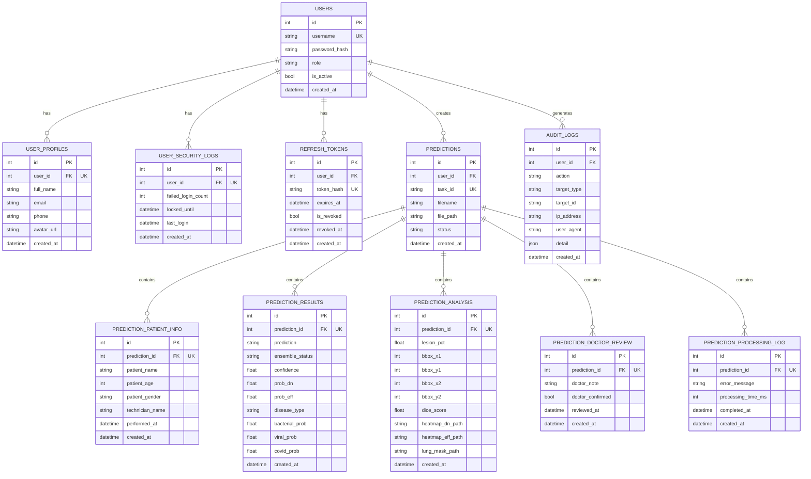
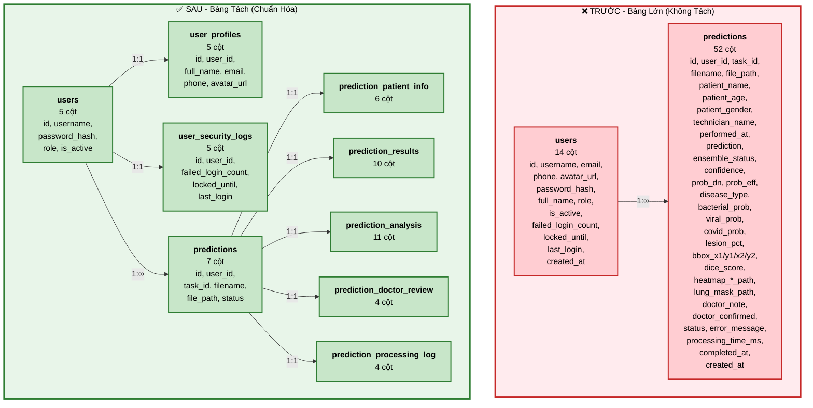
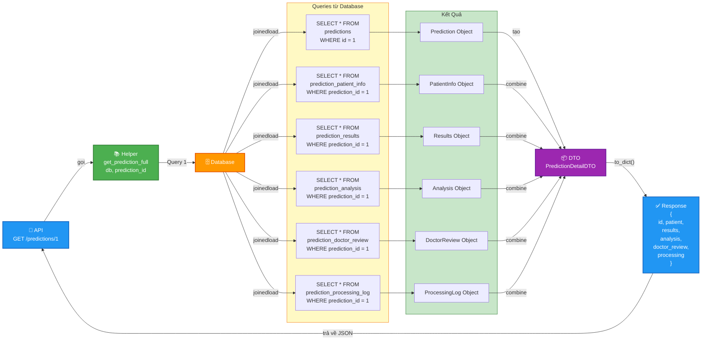

# 📊 Sơ Đồ ERD - Pneumonia Detection System

Các sơ đồ Entity Relationship Diagram (ERD) cho cơ sở dữ liệu sau khi tách bảng.

---

## 📊 Sơ Đồ 1: ERD Đầy Đủ (Full Schema)



---

## 📊 Sơ Đồ 2: So Sánh Trước/Sau Khi Tách Bảng



---

## 📊 Sơ Đồ 3: Data Flow - Truy Vấn Dữ Liệu Chi Tiết



---

## 🔍 Hướng Dẫn Sử Dụng

### Xem trên GitHub
- Tất cả các sơ đồ Mermaid sẽ tự động render trên GitHub

### Xem trên Obsidian / Notion
- Copy paste markdown code vào các ứng dụng này để render

### Chuyển đổi sang PNG/SVG
Sử dụng [Mermaid CLI](https://mermaid.js.org/syntax/graph.html):

```bash
# Cài đặt
npm install -g @mermaid-js/mermaid-cli

# Chuyển đổi
mmdc -i diagrams.md -o diagrams.pdf
```

### Hoặc sử dụng Mermaid Live
- Truy cập: https://mermaid.live
- Paste Mermaid code để render

---

## 📝 Ghi Chú

- **PK**: Primary Key
- **FK**: Foreign Key
- **UK**: Unique Key
- **1:∞**: Một-Nhiều
- **1:1**: Một-Một

---

Generated: 2026-05-06
