# 📊 Use Case Diagrams - Pneumonia Detection System

Tài liệu mô tả các trường hợp sử dụng (Use Cases) của hệ thống phát hiện viêm phổi.

---

## 📋 Nội Dung

1. [Use Case Tổng Quát](#use-case-tổng-quát)
2. [Actors (Người Dùng)](#actors-người-dùng)
3. [Chi Tiết Các Use Cases](#chi-tiết-các-use-cases)
4. [Prediction Processing Flow](#prediction-processing-flow)
5. [Authentication Flow](#authentication-flow)

---

## 📊 Use Case Tổng Quát

```mermaid
graph TB
    subgraph Actors["👥 Actors"]
        User["👤 User<br/>(Technician/Client)"]
        Doctor["👨‍⚕️ Doctor"]
        Admin["👨‍💼 Admin"]
        System["🖥️ System<br/>(AI/Server)"]
    end
    
    subgraph Auth["🔐 Authentication"]
        UC1["Register<br/>Tạo tài khoản mới"]
        UC2["Login<br/>Đăng nhập"]
        UC3["Logout<br/>Đăng xuất"]
        UC4["Refresh Token<br/>Làm mới token"]
    end
    
    subgraph Predict["🔍 Prediction"]
        UC5["Upload Image<br/>Tải ảnh X-ray"]
        UC6["Single Prediction<br/>Dự đoán 1 ảnh"]
        UC7["Batch Upload<br/>Tải nhiều ảnh"]
        UC8["View Progress<br/>Xem tiến độ"]
        UC9["Download Result<br/>Tải kết quả PDF"]
    end
    
    subgraph History["📋 History & Review"]
        UC10["View History<br/>Xem lịch sử"]
        UC11["Filter History<br/>Lọc theo tiêu chí"]
        UC12["View Details<br/>Xem chi tiết"]
        UC13["Doctor Review<br/>Xét duyệt kết quả"]
        UC14["Add Note<br/>Thêm ghi chú"]
        UC15["Confirm Result<br/>Xác nhận dự đoán"]
    end
    
    subgraph Stats["📊 Statistics"]
        UC16["View Dashboard<br/>Xem thống kê"]
        UC17["View Charts<br/>Xem biểu đồ"]
        UC18["Export Report<br/>Xuất báo cáo"]
    end
    
    subgraph Admin["⚙️ Administration"]
        UC19["Manage Users<br/>Quản lý người dùng"]
        UC20["Create User<br/>Tạo user"]
        UC21["Update User<br/>Sửa thông tin user"]
        UC22["Delete User<br/>Xóa user"]
        UC23["View Audit Log<br/>Xem nhật ký hoạt động"]
        UC24["Admin Dashboard<br/>Thống kê admin"]
    end
    
    subgraph Processing["⚙️ Processing"  ]
        UC25["Queue Task<br/>Xếp hàng xử lý"]
        UC26["Process Image<br/>Xử lý hình ảnh"]
        UC27["Run AI Models<br/>Chạy mô hình AI"]
        UC28["Generate Report<br/>Tạo báo cáo"]
        UC29["Send Notification<br/>Gửi thông báo"]
    end
    
    User -->|"uses"| UC1
    User -->|"uses"| UC2
    User -->|"uses"| UC3
    User -->|"uses"| UC5
    User -->|"uses"| UC6
    User -->|"uses"| UC7
    User -->|"uses"| UC8
    User -->|"uses"| UC10
    User -->|"uses"| UC11
    User -->|"uses"| UC12
    User -->|"uses"| UC16
    User -->|"uses"| UC17
    
    Doctor -->|"uses"| UC2
    Doctor -->|"uses"| UC12
    Doctor -->|"uses"| UC13
    Doctor -->|"uses"| UC14
    Doctor -->|"uses"| UC15
    Doctor -->|"uses"| UC16
    
    Admin -->|"uses"| UC2
    Admin -->|"uses"| UC19
    Admin -->|"uses"| UC20
    Admin -->|"uses"| UC21
    Admin -->|"uses"| UC22
    Admin -->|"uses"| UC23
    Admin -->|"uses"| UC24
    
    System -->|"triggers"| UC25
    System -->|"executes"| UC26
    System -->|"executes"| UC27
    System -->|"generates"| UC28
    System -->|"sends"| UC29
    
    UC5 -->|"triggers"| UC25
    UC6 -->|"triggers"| UC25
    UC7 -->|"triggers"| UC25
    UC25 -->|"involves"| UC26
    UC26 -->|"involves"| UC27
    UC27 -->|"involves"| UC28
    UC28 -->|"triggers"| UC29
    UC8 -->|"monitors"| UC25
    UC29 -->|"notifies"| User
    UC29 -->|"notifies"| Doctor
    
    style Actors fill:#e1f5ff,stroke:#01579b,stroke-width:2px
    style Auth fill:#f3e5f5,stroke:#4a148c,stroke-width:2px
    style Predict fill:#e8f5e9,stroke:#1b5e20,stroke-width:2px
    style History fill:#fff3e0,stroke:#e65100,stroke-width:2px
    style Stats fill:#fce4ec,stroke:#880e4f,stroke-width:2px
    style Admin fill:#f1f8e9,stroke:#33691e,stroke-width:2px
    style Processing fill:#ede7f6,stroke:#311b92,stroke-width:2px
```



---

## 👥 Actors (Người Dùng)

### 1. **User (Technician/Client)**
- 🔍 Chủ yếu sử dụng tính năng **Prediction**
- 📊 Xem **thống kê** và **lịch sử**
- 🔐 **Đăng nhập/đăng xuất**
- **Không có quyền**: Quản lý người dùng, Admin

### 2. **Doctor**
- ✅ **Xét duyệt** kết quả dự đoán
- 📝 **Thêm ghi chú** y tế
- ✔️ **Xác nhận** dự đoán
- 📊 Xem **thống kê** tổng quát
- **Không có quyền**: Quản lý người dùng

### 3. **Admin**
- 👥 **Quản lý người dùng** (tạo, sửa, xóa)
- 📋 Xem **nhật ký kiểm toán** (Audit logs)
- 📊 Xem **Admin Dashboard** (thống kê hệ thống)
- 🔐 Quản lý **quyền hạn** người dùng

### 4. **System**
- ⚙️ **Xử lý** công việc từ queue
- 🤖 **Chạy mô hình AI** (UNet, DenseNet, EfficientNet)
- 📧 **Gửi thông báo** cho người dùng

---

## 📖 Chi Tiết Các Use Cases

### 🔐 Authentication (Xác Thực)

#### UC1: Register (Đăng Ký)
```
Actors: User
Preconditions: User không có tài khoản
Flow:
  1. User nhập username, email, password, full_name
  2. System validate dữ liệu
  3. System check username/email đã tồn tại?
  4. Nếu OK, hash password + tạo user record
  5. System sinh access_token (8h expire) & refresh_token (30d)
  6. System lưu refresh_token hash vào database
  7. Return tokens + user info
  8. Frontend lưu tokens vào localStorage
  9. Redirect đến dashboard
Postconditions: User được tạo, đã đăng nhập
```

#### UC2: Login (Đăng Nhập)
```
Actors: User
Preconditions: User có tài khoản
Flow:
  1. User nhập username + password
  2. System check rate limit (10 req/min)
  3. System query user by username
  4. Nếu không tìm thấy → Error 401
  5. System verify password (bcrypt)
  6. Nếu sai:
     - Increment failed_login_count
     - Nếu failed_count >= 5 → Lock account 30min
     - Error 401
  7. Nếu đúng:
     - Reset failed_login_count = 0
     - Update last_login = now
     - Generate access_token + refresh_token
     - Save tokens
  8. Redirect đến dashboard
Postconditions: User logged in, có valid tokens
```

#### UC3: Logout (Đăng Xuất)
```
Actors: User
Preconditions: User đã logged in
Flow:
  1. User click logout button
  2. System revoke refresh_token (set is_revoked=true)
  3. Clear tokens from localStorage
  4. Redirect đến login page
Postconditions: User logged out
```

#### UC4: Refresh Token
```
Actors: System, User
Preconditions: Access token expired, refresh token valid
Flow:
  1. System detect access token expired
  2. System send refresh_token to API
  3. API validate refresh_token (not revoked, not expired)
  4. API generate new access_token
  5. Frontend update token
  6. Continue using new token
Postconditions: New access token issued
```

---

### 🔍 Prediction (Dự Đoán)

#### UC5: Upload Image (Tải Ảnh)
```
Actors: User
Preconditions: User đã logged in
Flow:
  1. User chọn ảnh X-ray (PNG, JPG) < 10MB
  2. Frontend validate file type + size
  3. Frontend preview ảnh
  4. User click "Analyze"
  5. Frontend upload file → API
  6. API verify token
  7. API save file to disk
  8. API create prediction record (status=queued)
  9. API enqueue Celery task
  10. Return task_id
Postconditions: File uploaded, task queued
```

#### UC6: Single Prediction (Dự Đoán Đơn)
```
Actors: User, System
Preconditions: Ảnh được upload (UC5)
Flow:
  1. System dequeue task from Celery
  2. System load 4 AI models (UNet, DenseNet, EfficientNet, DenseNet_T2)
  3. System preprocess image (resize, normalize)
  4. System run inference trên 4 models
  5. System generate Grad-CAM heatmaps (tổng + chi tiết)
  6. System extract bounding box of pneumonia region
  7. System ensemble predictions (majority voting)
  8. System classify disease type:
     - Bacterial vs Viral vs COVID (logistic regression)
     - Extract probabilities
  9. System update prediction record:
     - prediction (NORMAL/PNEUMONIA)
     - confidence score
     - disease_type + probabilities
     - Grad-CAM paths
     - bounding_box coordinates
     - status = done
  10. System send WebSocket event (real-time update)
  11. Frontend render results
Postconditions: Prediction completed, results displayed
```

#### UC7: Batch Upload (Tải Nhiều Ảnh)
```
Actors: User, System
Preconditions: User muốn xử lý nhiều ảnh cùng lúc
Flow:
  1. User select multiple files (> 1)
  2. Frontend validate tất cả files
  3. Frontend upload files → API
  4. API create batch_job record (status=queued, total=N)
  5. API create batch_items (N items)
  6. API enqueue N tasks vào Celery
  7. Return batch_id
  8. Frontend poll batch status or WebSocket
  9. System process items tuần tự:
     - Dequeue task
     - Process (UC6)
     - Update batch_items.status = done
     - Increment batch_job.completed
  10. Khi all items done → batch_job.status = done
  11. Frontend show batch completion
Postconditions: All images processed, batch completed
```

#### UC8: View Progress (Xem Tiến Độ)
```
Actors: User
Preconditions: Có predictions đang xử lý
Flow:
  1. Frontend open WebSocket connection
  2. Frontend subscribe to task_id events
  3. System broadcast progress updates:
     - status: queued, processing, done, failed
     - progress_percent: 10%, 40%, 80%, 100%
  4. Frontend update progress bar
  5. Khi status=done:
     - Stop polling
     - Display results
Postconditions: User see real-time progress
```

#### UC9: Download Result (Tải Kết Quả PDF)
```
Actors: User
Preconditions: Prediction completed
Flow:
  1. User click "Export PDF"
  2. Frontend request: GET /api/predict/{id}/pdf
  3. API generate PDF report:
     - Patient info
     - Original X-ray image
     - Grad-CAM heatmaps
     - Prediction result
     - Confidence scores
     - Doctor note (if exists)
  4. API return PDF file
  5. Frontend download
Postconditions: PDF file downloaded
```

---

### 📋 History & Review (Lịch Sử & Xét Duyệt)

#### UC10: View History (Xem Lịch Sử)
```
Actors: User, Doctor
Preconditions: Có predictions trong database
Flow:
  1. User navigate to History page
  2. Frontend query: GET /api/predict/history?page=1&limit=20
  3. API return list of predictions (paginated)
  4. Frontend display table:
     - task_id, patient_name, prediction, confidence
     - created_at, status, doctor_confirmed
  5. User can view, sort, scroll
Postconditions: History displayed
```

#### UC11: Filter History (Lọc Lịch Sử)
```
Actors: User, Doctor
Preconditions: Viewing history (UC10)
Flow:
  1. User set filters:
     - Date range
     - Prediction (NORMAL/PNEUMONIA)
     - Disease type (BACTERIAL/VIRAL/COVID)
     - Doctor confirmed (yes/no)
     - Status (queued/processing/done/failed)
  2. Frontend query with filter params
  3. API filter predictions in database
  4. Return filtered results
  5. Frontend update table
Postconditions: Filtered results displayed
```

#### UC12: View Details (Xem Chi Tiết)
```
Actors: User, Doctor
Preconditions: Viewing history (UC10)
Flow:
  1. User click on prediction row
  2. Frontend navigate to detail page
  3. Frontend query: GET /api/predict/{id}
  4. API return full prediction data
  5. Frontend display:
     - Patient info (name, age, gender, technician)
     - Original X-ray image
     - Grad-CAM heatmaps (2 ảnh: normal + pneumonia)
     - Bounding box overlay
     - Predictions + confidences
     - Disease type + probabilities
     - Processing time
     - Doctor note
Postconditions: Detail view displayed
```

#### UC13: Doctor Review (Xét Duyệt)
```
Actors: Doctor
Preconditions: Viewing prediction detail (UC12), Doctor role
Flow:
  1. Doctor review prediction results
  2. Doctor click "Confirm Prediction"
  3. Doctor optionally add note (UC14)
  4. Doctor click "Submit"
  5. Frontend POST: /api/predict/{id}/confirm
  6. API update prediction:
     - doctor_confirmed = true
     - Add audit log (action=confirm)
  7. Return success
Postconditions: Prediction marked as confirmed by doctor
```

#### UC14: Add Note (Thêm Ghi Chú)
```
Actors: Doctor
Preconditions: Viewing prediction detail (UC12)
Flow:
  1. Doctor click "Add Note" / Edit note
  2. Doctor type medical note (TEXT)
  3. Doctor click "Save"
  4. Frontend POST: /api/predict/{id}/note
  5. API update doctor_note field
  6. Add audit log (action=add_note)
  7. Return success
Postconditions: Note saved
```

#### UC15: Confirm Result (Xác Nhận Dự Đoán)
```
Actors: Doctor
Preconditions: Doctor has reviewed (UC13)
Flow:
  1. Doctor click "Confirm" button
  2. Frontend POST: /api/predict/{id}/confirm
  3. API set doctor_confirmed = true
  4. Add audit log
  5. Create notification for user
  6. Update prediction status
  7. Return success
Postconditions: Prediction confirmed
```

---

### 📊 Statistics (Thống Kê)

#### UC16: View Dashboard (Xem Thống Kê)
```
Actors: User, Doctor
Preconditions: User logged in
Flow:
  1. Navigate to Stats page
  2. Frontend query: GET /api/stats/dashboard
  3. API return statistics:
     - Total predictions (user specific or all)
     - NORMAL vs PNEUMONIA count
     - CONFIRMED vs SUSPECTED count
     - Average processing time
     - Today's predictions
  4. Frontend display KPI cards
  5. Display charts (pie, bar, line)
Postconditions: Dashboard displayed
```

#### UC17: View Charts (Xem Biểu Đồ)
```
Actors: User, Doctor
Preconditions: Viewing dashboard (UC16)
Flow:
  1. User view multiple charts:
     - Disease type distribution (pie chart)
     - Prediction result (pie: NORMAL vs PNEUMONIA)
     - Ensemble status (CONFIRMED vs SUSPECTED)
     - Weekly predictions (line chart)
     - Accuracy trend
  2. User can hover for details
  3. User can export chart as image
Postconditions: Charts displayed
```

#### UC18: Export Report (Xuất Báo Cáo)
```
Actors: User, Doctor
Preconditions: Viewing dashboard (UC16)
Flow:
  1. User click "Export Report"
  2. Frontend request: GET /api/stats/report/export
  3. API generate report:
     - Summary statistics
     - Charts
     - Detailed prediction list
     - Format: PDF or CSV
  4. API return file
  5. Frontend download
Postconditions: Report file downloaded
```

---

### ⚙️ Administration (Quản Trị)

#### UC19: Manage Users (Quản Lý Người Dùng)
```
Actors: Admin
Preconditions: Admin logged in
Flow:
  1. Admin navigate to Users page
  2. Frontend query: GET /api/admin/users?page=1&limit=20
  3. API return list of users
  4. Frontend display table:
     - username, email, role, is_active, created_at
     - Actions: view, edit, delete
Postconditions: User list displayed
```

#### UC20: Create User (Tạo User)
```
Actors: Admin
Preconditions: Viewing user management (UC19)
Flow:
  1. Admin click "Add User"
  2. Open dialog with form:
     - username, email, password, full_name, role
  3. Admin fill form
  4. Admin click "Create"
  5. Frontend POST: /api/admin/users
  6. API validate fields
  7. API create user record
  8. Add audit log (action=admin_create_user)
  9. Return new user
Postconditions: User created
```

#### UC21: Update User (Sửa User)
```
Actors: Admin
Preconditions: Viewing user detail
Flow:
  1. Admin click "Edit"
  2. Open form with user data
  3. Admin modify fields:
     - email, full_name, role, is_active, password
  4. Admin click "Save"
  5. Frontend PUT: /api/admin/users/{id}
  6. API update user record
  7. Add audit log (action=admin_update_user)
  8. Return updated user
Postconditions: User updated
```

#### UC22: Delete User (Xóa User)
```
Actors: Admin
Preconditions: Viewing user detail
Flow:
  1. Admin click "Delete"
  2. Confirm dialog
  3. Admin confirm
  4. Frontend DELETE: /api/admin/users/{id}
  5. API soft-delete or hard-delete user
  6. Add audit log (action=admin_delete_user)
  7. Return success
Postconditions: User deleted
```

#### UC23: View Audit Log (Xem Nhật Ký)
```
Actors: Admin
Preconditions: Admin logged in
Flow:
  1. Admin navigate to Audit Log page
  2. Frontend query: GET /api/admin/audit-logs?page=1&limit=50
  3. API return list of audit logs
  4. Frontend display table:
     - user (who), action, target_type, created_at
     - ip_address, user_agent, details (JSON)
  5. Admin can filter by:
     - Date range
     - User
     - Action type
Postconditions: Audit logs displayed
```

#### UC24: Admin Dashboard (Thống Kê Admin)
```
Actors: Admin
Preconditions: Admin logged in
Flow:
  1. Navigate to Admin Dashboard
  2. Frontend query: GET /api/admin/dashboard
  3. API return:
     - Total users, active users, inactive users
     - Total predictions, done, failed
     - Recent activities
  4. Frontend display dashboard with KPI cards
  5. Display system health status
Postconditions: Admin dashboard displayed
```

---

## 🔄 Prediction Processing Flow

```mermaid
sequenceDiagram
    participant User as 👤 User
    participant Frontend as 🌐 Frontend
    participant API as 🔌 API<br/>FastAPI
    participant Queue as 📨 Queue<br/>Celery+Redis
    participant Worker as 🤖 Worker
    participant DB as 🗄️ Database
    participant Email as 📧 Email
    
    User->>Frontend: 1. Chọn ảnh X-ray
    Frontend->>Frontend: 2. Validate file
    Frontend->>API: 3. POST /api/predict/upload
    API->>API: 4. Verify JWT token
    API->>API: 5. Save file to disk
    API->>DB: 6. Create prediction record
    DB-->>API: prediction_id, task_id
    API->>Queue: 7. Enqueue task<br/>(prediction_id)
    Queue-->>API: task queued
    API-->>Frontend: 8. Return task_id<br/>(status: queued)
    Frontend-->>User: 9. Show loading page
    
    User->>Frontend: 10. Open WebSocket<br/>for real-time updates
    
    par Processing
        Queue->>Worker: 11. Dequeue task
        Worker->>Worker: 12. Load AI models<br/>(UNet, DenseNet, EfficientNet)
        Worker->>Worker: 13. Preprocess image
        Worker->>Worker: 14. Run inference<br/>(4 models)
        Worker->>Worker: 15. Generate heatmaps<br/>(Grad-CAM)
        Worker->>Worker: 16. Extract bounding box
        Worker->>Worker: 17. Ensemble prediction<br/>(majority voting)
        Worker->>Worker: 18. Classify disease type<br/>(Bacterial/Viral/COVID)
        Worker->>DB: 19. Update prediction<br/>results & files
        Worker->>Queue: 20. Send WebSocket event<br/>(status: done)
    and Monitoring
        Frontend->>API: WebSocket: Check status
        API->>Queue: Poll task state
        Queue-->>API: status = processing (40%)
        API-->>Frontend: Real-time progress
        Frontend-->>User: Update progress bar
    end
    
    Queue-->>Frontend: 21. WebSocket notify<br/>(status: done)
    Frontend-->>User: 22. Show results:<br/>- Prediction (NORMAL/PNEUMONIA)<br/>- Confidence score<br/>- Disease type<br/>- Heatmaps<br/>- Bounding box
    
    User->>Frontend: 23. Click "Add Note"
    Frontend->>API: 24. POST /api/predict/{id}/note
    API->>DB: 25. Update doctor_note
    DB-->>API: OK
    API-->>Frontend: OK
    Frontend-->>User: Note saved
    
    User->>Frontend: 26. Click "Export PDF"
    Frontend->>API: 27. GET /api/predict/{id}/pdf
    API->>API: 28. Generate PDF report
    API-->>Frontend: PDF file
    Frontend-->>User: 29. Download PDF
    
    style User fill:#e8f5e9
    style Frontend fill:#fff9c4
    style API fill:#bbdefb
    style Queue fill:#f0f4c3
    style Worker fill:#c8e6c9
    style DB fill:#ffccbc
    style Email fill:#f8bbd0
```

---

## 🔐 Authentication Flow

```mermaid
sequenceDiagram
    participant User as 👤 User
    participant Frontend as 🌐 Frontend
    participant API as 🔌 API
    participant JWT as 🔐 JWT<br/>Manager
    participant DB as 🗄️ Database
    
    rect rgb(200, 150, 255)
    note over User,DB: REGISTRATION
    User->>Frontend: 1. Input: username,<br/>email, password, name
    Frontend->>Frontend: 2. Validate input
    Frontend->>API: 3. POST /api/auth/register
    API->>DB: 4. Check username exists?
    alt Username exists
        DB-->>API: Error
        API-->>Frontend: 400: Username exists
        Frontend-->>User: ❌ Error message
    else OK
        API->>DB: 5. Check email exists?
        alt Email exists
            DB-->>API: Error
            API-->>Frontend: 400: Email exists
            Frontend-->>User: ❌ Error message
        else OK
            API->>API: 6. Hash password (bcrypt)
            API->>DB: 7. Create user record
            DB-->>API: user_id, created_at
            API->>JWT: 8. Generate access_token<br/>(user_id, role, exp=8h)
            JWT-->>API: access_token
            API->>JWT: 9. Generate refresh_token<br/>(exp=30d)
            JWT-->>API: refresh_token
            API->>DB: 10. Store refresh_token<br/>hash in DB
            API->>DB: 11. Create audit log<br/>(action=register)
            DB-->>API: OK
            API-->>Frontend: 200: OK<br/>{access_token, refresh_token, user}
            Frontend-->>Frontend: 12. Save tokens<br/>(localStorage)
            Frontend-->>User: ✅ Registered!<br/>Redirect to dashboard
        end
    end
    end
    
    rect rgb(200, 200, 255)
    note over User,DB: LOGIN
    User->>Frontend: 13. Input: username,<br/>password
    Frontend->>API: 14. POST /api/auth/login
    API->>API: 15. Rate limit check<br/>(10 req/min)
    alt Rate limited
        API-->>Frontend: 429: Too many requests
    else OK
        API->>DB: 16. Query user<br/>by username
        alt User not found
            DB-->>API: null
            API-->>Frontend: 401: Invalid credentials
            Frontend-->>User: ❌ Invalid credentials
        else User found
            API->>API: 17. Verify password<br/>(bcrypt)
            alt Password incorrect
                API->>DB: 18. Increment failed_login_count
                alt failed_count >= 5
                    API->>DB: 19. Lock account<br/>locked_until = now + 30min
                end
                API-->>Frontend: 401: Invalid credentials
                Frontend-->>User: ❌ Invalid credentials
            else Password correct
                API->>DB: 20. Reset failed_login_count = 0
                API->>DB: 21. Update last_login = now
                API->>JWT: 22. Generate access_token
                JWT-->>API: access_token
                API->>JWT: 23. Generate refresh_token
                JWT-->>API: refresh_token
                API->>DB: 24. Store refresh_token hash
                API->>DB: 25. Create audit log (action=login)
                API-->>Frontend: 200: OK<br/>{access_token, refresh_token, user}
                Frontend-->>Frontend: 26. Save tokens
                Frontend-->>User: ✅ Logged in!<br/>Redirect to dashboard
            end
        end
    end
    end
    
    rect rgb(150, 200, 255)
    note over User,DB: REFRESH TOKEN
    User->>Frontend: 27. Access token expired?
    Frontend->>Frontend: 28. Check token exp
    alt Token not expired
        Frontend-->>User: ✅ Continue using<br/>current token
    else Token expired
        Frontend->>API: 29. POST /api/auth/refresh<br/>{refresh_token}
        API->>DB: 30. Query refresh_token
        alt Token not found/revoked
            DB-->>API: null
            API-->>Frontend: 401: Invalid refresh token
            Frontend-->>Frontend: 31. Clear tokens
            Frontend-->>User: ❌ Please login again
        else Token valid
            API->>JWT: 32. Generate new access_token
            JWT-->>API: new access_token
            API-->>Frontend: 200: {access_token}
            Frontend-->>Frontend: 33. Update token<br/>in localStorage
            Frontend-->>User: ✅ Token refreshed
        end
    end
    end
    
    rect rgb(200, 150, 150)
    note over User,DB: LOGOUT
    User->>Frontend: 34. Click logout
    Frontend->>API: 35. POST /api/auth/logout<br/>{refresh_token}
    API->>DB: 36. Query refresh_token
    alt Token found
        API->>DB: 37. Revoke token<br/>(is_revoked=true, revoked_at=now)
        DB-->>API: OK
    end
    API-->>Frontend: 200: Logged out
    Frontend-->>Frontend: 38. Clear tokens<br/>from localStorage
    Frontend-->>User: ✅ Logged out!<br/>Redirect to login
    end
    
    style User fill:#e8f5e9
    style Frontend fill:#fff9c4
    style API fill:#bbdefb
    style JWT fill:#f3e5f5
    style DB fill:#ffccbc
```

---

## 📝 Tóm Tắt Use Cases

| Use Case | Actor | Preconditions | Postconditions |
|----------|-------|---|---|
| Register | User | Không có tài khoản | User account created, logged in |
| Login | User | Có tài khoản | User logged in, tokens received |
| Logout | User | Logged in | User logged out, tokens cleared |
| Refresh Token | System | Access token expired | New access token issued |
| Upload Image | User | Logged in | File saved, task queued |
| Single Prediction | System | File uploaded | Prediction completed |
| Batch Upload | User | Logged in | Multiple files queued |
| View Progress | User | Upload ảnh | Real-time progress displayed |
| Download Result | User | Prediction done | PDF file downloaded |
| View History | User | Logged in | History list displayed |
| Filter History | User | Viewing history | Filtered results shown |
| View Details | User | Viewing history | Prediction detail displayed |
| Doctor Review | Doctor | Viewing details | Prediction reviewed |
| Add Note | Doctor | Viewing details | Note saved |
| Confirm Result | Doctor | Reviewed | Prediction confirmed |
| View Dashboard | User/Doctor | Logged in | Statistics displayed |
| View Charts | User/Doctor | Viewing dashboard | Charts displayed |
| Export Report | User/Doctor | Viewing dashboard | Report downloaded |
| Manage Users | Admin | Logged in (admin) | User list displayed |
| Create User | Admin | Viewing users | New user created |
| Update User | Admin | Viewing user | User updated |
| Delete User | Admin | Viewing user | User deleted |
| View Audit Log | Admin | Logged in (admin) | Audit log displayed |
| Admin Dashboard | Admin | Logged in (admin) | Admin stats displayed |

---

## 🔄 Tương Tác Giữa Use Cases

```
Register → Login → Upload Image
                ↓
          Single/Batch Prediction
                ↓
          View Progress
                ↓
          View History → View Details
                          ↓
                    Doctor Review/Add Note/Confirm
                    Download Result/View Dashboard
                          ↓
                    Admin: Manage Users/View Audit
```

---

Generated: 2026-05-06
